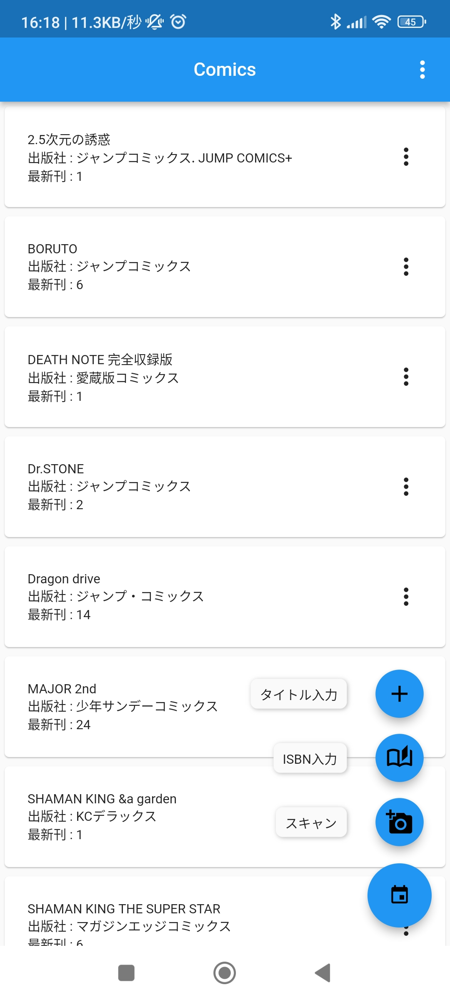
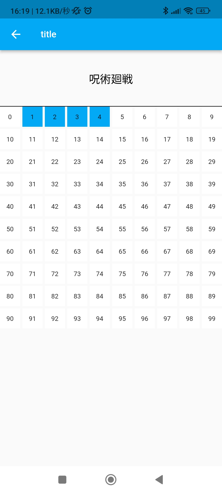
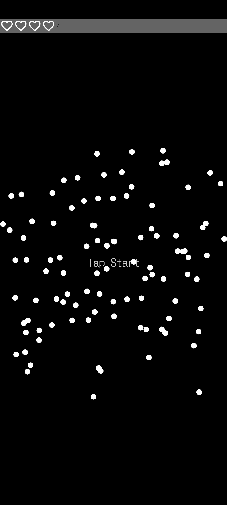
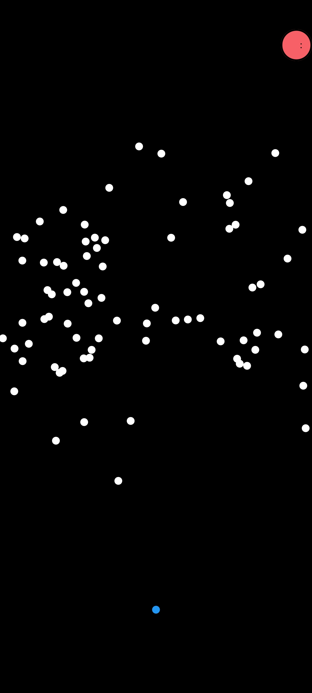
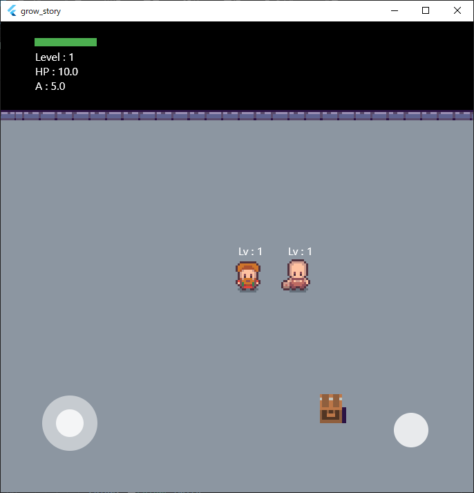
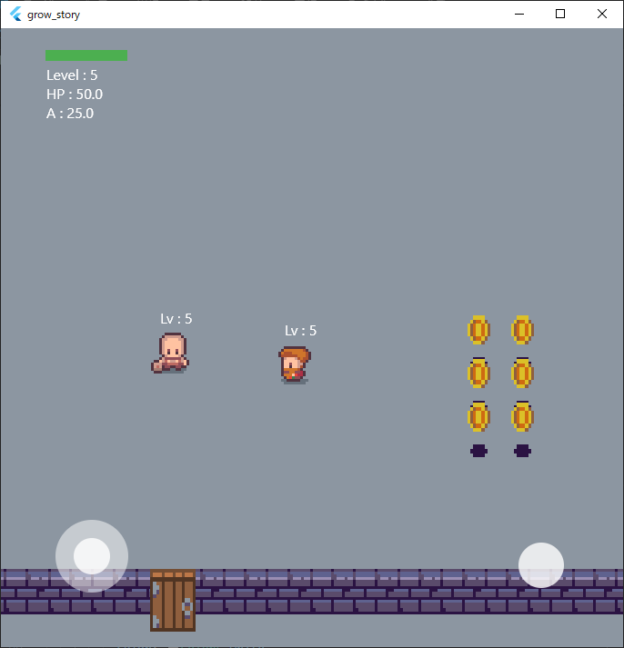

# Portfolio

## 目次

|No|||
|--|--|--|
|1|[Flutter](#flutter)||
||[コミック管理アプリ](#コミック管理アプリ)||
||[あぼいど あ ぼーる](#あぼいど-あ-ぼーる)||
||[grow story](#grow-story)||
||||

---

## **Flutter**

### **コミック管理アプリ**

集めている漫画を管理するアプリ。<br>
漫画の裏側に記載されている ISBN を読み取り自動でタイトルと巻数を取得でき、簡単に登録できる。<br>
その他カレンダー方式での簡単入力も可能。<br>

|||
|--|--|
|||

<details>

<summary>main.dart</summary>

```Dart

import 'dart:convert';
import 'dart:math';
import './size_config.dart';
import 'dialog_showdialog.dart';

import 'package:flutter/material.dart';
import 'package:flutter/services.dart';
import 'package:http/http.dart' as http;
import 'package:comic_sqlite2/src_drift/books.dart'; 
import 'package:barcode_scan2/platform_wrapper.dart';
import 'package:flutter_speed_dial/flutter_speed_dial.dart';

void main() {
  final database = MyDatabase(); 
  runApp(MyApp(database: database)); 
}

extension JapaneseString on String {
  String alphanumericToFullLength() {
    final regex = RegExp(r'^[a-zA-Z0-9]+$');
    final string = runes.map<String>((rune) {
      final char = String.fromCharCode(rune);
      return regex.hasMatch(char) ? String.fromCharCode(rune + 65248) : char;
    });
    return string.join();
  }

  String alphanumericToHalfLength() {
    final regex = RegExp(r'^[Ａ-Ｚａ-ｚ０-９]+$');
    final string = runes.map<String>((rune) {
      final char = String.fromCharCode(rune);
      return regex.hasMatch(char) ? String.fromCharCode(rune - 65248) : char;
    });
    return string.join();
  }
}

class MyApp extends StatelessWidget {
  const MyApp({
    Key? key,
    required this.database,
  }) : super(key: key); 
  final MyDatabase database; 

  @override
  Widget build(BuildContext context) {
    return MaterialApp(
      title: 'Flutter Demo',
      theme: ThemeData(
        primarySwatch: Colors.blue,
      ),
      home: MyHomePage(database: database), 
    );
  }
}

class MyHomePage extends StatefulWidget {
  MyHomePage({
    Key? key,
    required this.database, 
  }) : super(key: key);
  final MyDatabase database;
  @override
  State<MyHomePage> createState() => _MyHomePageState();
}

class _MyHomePageState extends State<MyHomePage> {
  String readData = "";

  
  popupMenuSelected(id, item) async {
    switch (id) {
      case '1':
        break;
      case '2':
        final comics = await widget.database.findItems(item);
        comics.forEach((element) {
          widget.database.deleteItem(element);
        });
        break;
      default:
        break;
    }
  }

  comicsData(code) async {
    final url = 'https://api.openbd.jp/v1/get?isbn=$code';
    String title;
    String volume;
    int isbn;
    List<String> matchTitle;
    http.Response response = await http.get(Uri.parse(url));

    if (response.statusCode == 200) {
      final res = jsonDecode(response.body);
      title = res[0]['onix']['DescriptiveDetail']['TitleDetail']['TitleElement']
              ['TitleText']['content']
          .toString()
          .alphanumericToHalfLength()
          .replaceAll('　', ' ');
      volume = res[0]['onix']['DescriptiveDetail']['TitleDetail']
              ['TitleElement']['PartNumber'] ??
          title.replaceAll(RegExp('\\D'), '');
      volume = volume.alphanumericToHalfLength();
      if (title.contains('(') == true) {
        int cutIndex = title.lastIndexOf('(');
        title = title.replaceRange(cutIndex, null, '');
      }
      if (title.contains('（') == true) {
        int cutIndex = title.lastIndexOf('（');
        title = title.replaceRange(cutIndex, null, '');
      }
      if (title.contains('=') == true) {
        int cutIndex = title.lastIndexOf('=');
        title = title.replaceRange(cutIndex, null, '');
      }
      final titleList = await widget.database.allBuyEntries;
      final comicList = await widget.database.allComicEntries;
      matchTitle = titleList
          .map((element) => element.name)
          .toList()
          .where((String titles) => titles == title)
          .toList();
      if (matchTitle.isEmpty == true) {
        matchTitle = titleList
            .map((element) => element.name)
            .toList()
            .where((String titles) => title.contains(titles) == true)
            .toList();
      }
      if (matchTitle.isEmpty == false) title = matchTitle[0];

      isbn = int.parse(res[0]['onix']['RecordReference']);

      showDialog(
        context: context,
        builder: (context) => ShowDialog(
          title: '詳細',
          text: [title, volume.toString()],
          function2: (control, numbers) async {
            if (control[0].text != '') title = control[0].text;
            if (control[1].text != '') {
              volume = (control[1].text);
            }

            final ref = await widget.database.findComics(title);
            if (ref.isEmpty == false) {
              widget.database
                  .addItem(ref[0].id, int.parse(volume), title, isbn);
            } else {
              widget.database.addComic(title);
              final ref = await widget.database.findComics(title);
              widget.database
                  .addItem(ref[0].id, int.parse(volume), title, isbn);
            }
          },
          other2: null,
          valueOnly: const [false, true],
        ),
      );
    }
  }

  getStatus(context) async {
    final counter = await widget.database.allBuyEntries;
    showDialog(
      context: context,
      builder: (context) {
        return SimpleDialog(
          title: const Text("詳細"),
          children: <Widget>[
           
            SimpleDialogOption(
              onPressed: () => Navigator.pop(context),
              child: Text("所持数 : ${counter.length.toString()}"),
            ),
          ],
        );
      },
    );
  }

  Future codeScan() async {
    try {
      var scan = await BarcodeScanner.scan();
      setState(() => {
            readData = scan.rawContent,
          });
      comicsData(readData);
    } on PlatformException catch (e) {
      if (e.code == BarcodeScanner.cameraAccessDenied) {
        setState(() {
          readData = 'Camera permissions are not valid.';
        });
      } else {
        setState(() => readData = 'Unexplained error : $e');
      }
    } on FormatException {
      setState(() => readData =
          'Failed to read (I used the back button before starting the scan).');
    } catch (e) {
      setState(() => readData = 'Unknown error : $e');
    }
  }

  @override
  Widget build(BuildContext context) {
    return Scaffold(
      appBar: AppBar(
        title: const Text('Comics'),
        centerTitle: true,
        actions: <Widget>[
          PopupMenuButton(onSelected: (String id) async {
            switch (id) {
              case '1':
                getStatus(context);
                break;
              default:
                break;
            }
          }, itemBuilder: (context) {
            return [
              const PopupMenuItem(child: Text('詳細'), value: '1'),
            ];
          })
        ],
      ),
      body: SafeArea(
        child: Column(
          mainAxisAlignment: MainAxisAlignment.spaceBetween,
          children: [
            Expanded(
              child: StreamBuilder(
                stream: widget.database.watchEntries(),
                builder:
                    (BuildContext context, AsyncSnapshot<List<Buy>> snapshot) {
                  if (snapshot.connectionState == ConnectionState.waiting) {
                    return const Center(child: CircularProgressIndicator());
                  }
                  return ListView(
                    children: snapshot.data!
                        .map((element) =>
                            element.name)
                        .toList()
                        .toSet()
                        .map(
                     
                      (String comic) {
                        //タイトル取得処理
                        return Card(
                          child: InkWell(
                            child: Padding(
                              padding: const EdgeInsets.all(20),
                              child: Row(children: [
                                Expanded(
                                  flex: 9,
                                  child: Column(
                                    crossAxisAlignment:
                                        CrossAxisAlignment.start,
                                    children: <Widget>[
                                      Text(comic.toString(),
                                          textAlign: TextAlign.left),
                                      Text(
                                          '最新刊 : ' +
                                              snapshot.data!
                                                  .where((element) =>
                                                      element.name ==
                                                      comic)出しリスト化
                                                  .toList()
                                                  .map((element) => element
                                                      .number)を取り出して 'number' のみをリスト化
                                                  .toList()
                                                  .reduce(max)
                                                  .toString(),
                                          textAlign: TextAlign.left),
                                    ],
                                  ),
                                ),
                                Expanded(
                                  flex: 1,
                                  child: PopupMenuButton(
                                    onSelected: (String id) {
                                      popupMenuSelected(id, comic);
                                    },
                                    itemBuilder: (context) {
                                      return [
                                        const PopupMenuItem(
                                            child: Text('変更'), value: '1'),
                                        const PopupMenuItem(
                                            child: Text('削除'), value: '2'),
                                      ];
                                    },
                                  ),
                                ),
                              ]),
                            ),
                            onTap: () async {
                              List<int> update = await Navigator.push(
                                context,
                                MaterialPageRoute(
                                  builder: (context) => FirstPage(
                                   
                                    title: comic.toString(),
                                    volume: snapshot.data!
                                        .where(
                                            (element) => element.name == comic)
                                        .toList()
                                        .map((element) => element.number)
                                        .toList(),'number' をリスト化して渡す
                                  ),
                                ),
                              );
                              final ref = await widget.database.findComics(
                                  comic);
                              snapshot.data!
                                  .where((element) => element.name == comic)
                                  .toList()
                                  .forEach(((element) => widget.database
                                      .deleteItem(
                                          element)));
                              if (update.isEmpty == false) {
                                update.forEach((number) => widget.database
                                    .addItem(ref[0].id, number, comic, 0));
                              } else {
                                final comics =
                                    await widget.database.findComics(comic);
                                widget.database.deleteComic(comics[0]);
                              }
                             
                             
                              print(snapshot.data);
                            },
                          ),
                        );
                      },
                    ).toList(),
                  );
                },
              ),
            ),
          ],
        ),
      ),
      floatingActionButton: SpeedDial(
        animatedIcon: AnimatedIcons.add_event,
       
        child: const Icon(Icons.add),
        backgroundColor: Colors.blue,
        closeManually: true,
        children: [
          SpeedDialChild(
              child: const Icon(Icons.add_a_photo),
              label: 'スキャン',
              backgroundColor: Colors.blue,
              onTap: () async {
                codeScan();
              }),
          SpeedDialChild(
              child: const Icon(Icons.auto_stories_outlined),
              label: 'ISBN入力',
              backgroundColor: Colors.blue,
              onTap: () {
                showDialog(
                    context: context,
                    builder: (context) => ShowDialog(
                          title: 'ISBN',
                          text: const ['半角数字 (ハイフンを除く)'],
                          other2: null,
                          function2: (control, number) {
                            comicsData(control[0].text);
                          },
                          valueOnly: const [true],
                        ));
              }),
          SpeedDialChild(
            child: const Icon(Icons.add),
            label: 'タイトル入力',
            backgroundColor: Colors.blue,
            onTap: () {
             
            },
          )
        ],
      ),
    );
  }
}

class FirstPage extends StatefulWidget {
  final String title;
  final List volume;
  const FirstPage({Key? key, required this.title, required this.volume})
      : super(key: key);に格納する

  @override
  State<FirstPage> createState() =>
      _FirstPageState(title, volume);
}

class _FirstPageState extends State<FirstPage> {
  var colorList = List.generate(100, (index) => Colors.white);
  var number = List.generate(100, (index) => 0);
  List<int> update = [];
  final String title;
  final List volume;
  _FirstPageState(this.title, this.volume) {
    volume.forEach((element) {
      number[element] = element;
      colorList[element] = Colors.lightBlue;
    });
  }

  void _event(index) {
    //　グリッドがタップされたときの処理
    setState(
      () {
        if (colorList[index] == Colors.white) {
         
          colorList[index] = Colors.lightBlue;
          if (number[index] == 0) {
            number[index] = index;
          }
        } else {
         
          colorList[index] = Colors.white;
          number[index] = 0;
        }
      },
    );
  }

  updateNumbers() async {
    number.forEach(
      (element) {
        if (element != 0) {
          update.add(element);
        }
      },
    );
    return update;
  }

  updateContents(String title) {}

  GridView calendar() {
    return GridView.count(
     
      crossAxisCount: 10,
      crossAxisSpacing: 4.0,
      mainAxisSpacing: 4.0,
      shrinkWrap: true,
      children: List.generate(
        100,
        (index) {
         
          return GestureDetector(
            child: Container(
              child: Center(child: Text(index.toString())),
              decoration: BoxDecoration(color: colorList[index]),
            ),
            onTap: () => _event(index),
          );
        },
      ),
    );
  }

  @override
  Widget build(BuildContext context) {
    SizeConfig().init(context);
    return WillPopScope(
     
      onWillPop: () {
        Navigator.pop(context, updateNumbers());
        return Future.value(false);
      },
      child: Scaffold(
        appBar: AppBar(
          title: const Text('title'),
          backgroundColor: Colors.lightBlue,
        ),
        body: SingleChildScrollView(
          child: Column(
            children: [
             
              Container(
               
                height: 100,
                width: double.infinity,
                decoration: const BoxDecoration(
                  border: Border(bottom: BorderSide(color: Colors.black)),
                ),
                child: TextButton(
                  child: Text(title,
                      textAlign: TextAlign.left,
                      style:
                          const TextStyle(color: Colors.black, fontSize: 24)),
                  onPressed: () {
                    updateContents(title);
                  },
                ),
              ),
              calendar(),
            ],
          ),
        ),
      ),
    );
  }
}

```

</details>

---

### **あぼいど あ ぼーる**

**※ 進行中**<br>
難易度に応じた数の玉を避け、タイムを競うゲーム。<br>
結果画面はSNS等でシェア可能！

|||
|--|--|
|||

<details><summary>main.dart</summary>

  ```Dart
    import 'package:avoid_balls/model.dart';
    import 'package:flutter/services.dart';
    import 'package:flutter/material.dart';
    import 'package:animated_text_kit/animated_text_kit.dart';
    import 'package:flame/game.dart';
    import 'package:flutter_riverpod/flutter_riverpod.dart';
    import 'package:google_fonts/google_fonts.dart';
    import 'package:google_mobile_ads/google_mobile_ads.dart';

    import 'game.dart';
    import 'topGame.dart';
    import 'overlay/confirm_reward.dart';
    import 'overlay/life.dart';
    import 'overlay/pause_button.dart';
    import 'overlay/pause.dart';
    import 'overlay/result.dart';
    import 'overlay/select.dart';

    void main() {
      WidgetsFlutterBinding.ensureInitialized();
      SystemChrome.setEnabledSystemUIMode(SystemUiMode.immersiveSticky);
      MobileAds.instance.initialize();

      runApp(const ProviderScope(child: MyApp()));
    }

    class MyApp extends ConsumerWidget {
      const MyApp({super.key});

      @override
      Widget build(BuildContext context, WidgetRef ref) {
        final GameModel gameModel = ref.read(gameProvider);
        return MaterialApp(
          theme: ThemeData(
            colorScheme: ColorScheme.fromSeed(seedColor: Colors.deepPurple),
            useMaterial3: true,
          ),
          home: TopPage(
            gameModel: gameModel,
          ),
        );
      }
    }

    class TopPage extends StatefulWidget {
      const TopPage({super.key, required this.gameModel});

      final GameModel gameModel;

      @override
      State<TopPage> createState() => _TopPageState();
    }

    class _TopPageState extends State<TopPage> with WidgetsBindingObserver {
      @override
      void initState() {
        super.initState();
        widget.gameModel.show = false;
        widget.gameModel.getAdMobs();
        WidgetsBinding.instance.addObserver(this);
        widget.gameModel.getDateTime();
      }

      @override
      void dispose() {
        widget.gameModel.disposeAdMobs();
        WidgetsBinding.instance.removeObserver(this);
        super.dispose();
      }

      @override
      void didChangeAppLifecycleState(AppLifecycleState state) {
        switch (state) {
          case AppLifecycleState.inactive:
            break;
          case AppLifecycleState.paused:
            widget.gameModel.setDateTime();
            break;
          case AppLifecycleState.resumed:
            widget.gameModel.getDateTime();
            break;
          case AppLifecycleState.detached:
            break;
          case AppLifecycleState.hidden:
            break;
        }
      }

      void start(BuildContext context, TopPageGame game) {
        widget.gameModel.adMob.load();
        widget.gameModel.rewardedAdManager.loadRewardedAd();
        widget.gameModel.changeTopPage();
        game.overlays.add('select');
      }

      @override
      Widget build(BuildContext context) {
        final game = TopPageGame(gameModel: widget.gameModel);
        return Scaffold(
          body: Center(
            child: Stack(
              children: [
                GameWidget<TopPageGame>(
                  game: game,
                  overlayBuilderMap: {
                    'select': (_, game) => Select(
                          game: game,
                          gameModel: widget.gameModel,
                        ),
                    'confirm': (_, game) => ConfirmReward(
                          game: game,
                          gameModel: widget.gameModel,
                        ),
                    'life': (_, game) => LifeBar(
                          game: game,
                          gameModel: widget.gameModel,
                        ),
                  },
                  initialActiveOverlays: const ['life'],
                ),
                Consumer(
                  builder: (context, ref, _) {
                    ref.watch(gameProvider);
                    return Offstage(
                      offstage: widget.gameModel.show,
                      child: Center(
                        child: GestureDetector(
                          child: Container(
                            width: double.infinity,
                            height: double.infinity / 2,
                            color: Colors.transparent,
                            child: Center(
                              child: AnimatedTextKit(
                                onTap: () {
                                  start(context, game);
                                },
                                animatedTexts: [
                                  FadeAnimatedText('Tap Start',
                                      textStyle: GoogleFonts.dotGothic16(
                                          fontSize: 24, color: Colors.white)),
                                ],
                                repeatForever: true,
                              ),
                            ),
                          ),
                          onTap: () {
                            start(context, game);
                          },
                        ),
                      ),
                    );
                  },
                ),
              ],
            ),
          ),
        );
      }
    }

    class GamePage extends StatefulWidget {
      const GamePage({super.key, required this.gameModel, required this.mode});
      final GameModel gameModel;
      final String mode;

      @override
      State<GamePage> createState() => _GamePageState();
    }

    class _GamePageState extends State<GamePage> {
      @override
      Widget build(BuildContext context) {
        final game = HelloGame(gameModel: widget.gameModel, mode: widget.mode);
        final convertWidgetToImageKey = GlobalKey();
        return RepaintBoundary(
          key: convertWidgetToImageKey,
          child: AspectRatio(
            aspectRatio: 16 / 9,
            child: Center(
              child: Container(
                width: double.infinity,
                color: Colors.white,
                child: GameWidget<HelloGame>(
                  game: game,
                  overlayBuilderMap: {
                    'result': (_, game) => Result(
                          game: game,
                          mode: widget.mode,
                          gameModel: widget.gameModel,
                          convertWidgetToImageKey: convertWidgetToImageKey,
                        ),
                    'pause': (_, game) {
                      game.pauseEngine;
                      return Pause(
                        game: game,
                      );
                    },
                    'pauseButton': (_, game) {
                      game.pauseEngine;
                      return PauseButton(
                        game: game,
                      );
                    }
                  },
                  initialActiveOverlays: const ['pauseButton'],
                ),
              ),
            ),
          ),
        );
      }
    }

  ```

</details>

<details><summary>pubspec.yaml</summary>

```yaml
name: avoid_balls
description: "A new Flutter project."
publish_to: 'none'
version: 1.0.0+1

environment:
  sdk: '>=3.3.0-91.0.dev <4.0.0'

dependencies:
  flutter:
    sdk: flutter
  convert: ^3.1.1
  flame: ^1.14.0
  google_mobile_ads: ^4.0.0
  flutter_riverpod: ^2.4.10
  animated_text_kit: ^4.2.2
  google_fonts: ^6.1.0
  share_plus: ^7.1.0
  path_provider: ^2.1.0
  shared_preferences: ^2.2.2
  flutter_launcher_icons: ^0.13.1

  cupertino_icons: ^1.0.2

dev_dependencies:
  flutter_test:
    sdk: flutter

  flutter_lints: ^3.0.0

flutter:
  uses-material-design: true
  
flutter_icons:
  android: true
  ios: true
  image_path: "assets/images/icon/icon.png"

```

</details>

---

### **grow story**

**※ 進行中**<br>
よくあるRPGとは少し違った育成RPG。<br>

|||
|--|--|
|||

<details><summary>main.dart</summary>

```Dart
import 'package:flutter/material.dart';
import 'package:flutter/foundation.dart';
import 'package:bonfire/bonfire.dart';
import 'package:grow_story/maps/test_map.dart';
import 'package:grow_story/player/player.dart';
import 'package:grow_story/player/player_sprite.dart';
import 'package:grow_story/enemy/enemy_sprite.dart';
import 'package:grow_story/decoration/item_sprite.dart';

void main() async {
  WidgetsFlutterBinding.ensureInitialized();
  if (!kIsWeb) {
    await Flame.device.setLandscape();
    await Flame.device.fullScreen();
  }
  await PlayerSpriteSheet.load();
  await EnemySpriteSheet.load();
  await ItemSpriteSheet.load();
  setupLocator();
  runApp(const MyApp());
}

class MyApp extends StatelessWidget {
  const MyApp({super.key});

  @override
  Widget build(BuildContext context) {
    return const MaterialApp(
      title: 'Simple Bonfire',
      debugShowCheckedModeBanner: false,
      home: DungeonMap01(),
    );
  }
}

```

</details>

<details><summary>test_map.dart</summary>

```Dart
import 'package:flutter/material.dart';
import 'package:bonfire/bonfire.dart';
import 'package:grow_story/decoration/box.dart';
import 'package:grow_story/decoration/door.dart';
import 'package:grow_story/enemy/enemy.dart';
import 'package:grow_story/enemy/enemy_sprite.dart';
import 'package:grow_story/player/player.dart';
import 'package:grow_story/decoration/coin.dart';
import 'package:grow_story/decoration/item_sprite.dart';
import 'package:grow_story/interface/top_interface.dart';

class DungeonMap01 extends StatefulWidget {
  const DungeonMap01({super.key});
  @override
  State<DungeonMap01> createState() => _DungeonMap01State();
}

class _DungeonMap01State extends State<DungeonMap01> {
  final tileSize = 48.0;
  final PlayerBeardedDude player = locator<PlayerBeardedDude>();

  void _addEnemy(BonfireGameInterface game) {
    game.add(
      EnemyBeardedDude(Vector2(tileSize * 9, tileSize * 4),
          spriteSheet: EnemySpriteSheet.all,
          initDirection: Direction.down,
          level: 1),
    );
    game.add(
      EnemyBeardedDude(Vector2(tileSize * 15, tileSize * 8),
          spriteSheet: EnemySpriteSheet.all,
          initDirection: Direction.down,
          level: 5),
    );
  }

  void _addCoin(BonfireGameInterface game) {
    for (int i = 0; i < 5; i++) {
      for (int l = 0; l < 3; l++) {
        game.add(
          Coin(
            Vector2(tileSize * (22 + l), tileSize * (8 + i)),
            spriteSheet: ItemSpriteSheet.all,
            initDirection: Direction.down,
          ),
        );
      }
    }
  }

  void _addBox(BonfireGameInterface game) {
    GameDecoration box = Box(
      Vector2(tileSize * 10, tileSize * 8),
      spriteSheet: ItemSpriteSheet.all,
      initDirection: Direction.down,
    );
    game.add(box);
    game.addJoystickObserver(box as PlayerControllerListener);
  }

  void _addDecoration(BonfireGameInterface game) {
    GameDecoration door = Door(
      Vector2(tileSize * 15, tileSize * 14),
      spriteSheet: ItemSpriteSheet.all,
      initDirection: Direction.down,
    );
    game.add(door);
    game.addJoystickObserver(door as PlayerControllerListener);
  }

  @override
  Widget build(BuildContext context) {
    return BonfireWidget(
      onReady: (game) {
        _addEnemy(game); 
        _addCoin(game);
        _addBox(game);
        _addDecoration(game);
      },
      interface: PlayerInterface(), 
      showCollisionArea: true,
      player: player,
      map: WorldMapByTiled(
        TiledReader.asset('maps/test_map.json'),
        forceTileSize: Vector2(tileSize, tileSize),
      ),
      joystick: Joystick(
        directional: JoystickDirectional(
          color: Colors.white,
        ),
        actions: [
          JoystickAction(
            color: Colors.white,
            actionId: 1,
            margin: const EdgeInsets.all(65),
          ),
        ],
      ),
    );
  }
}

```

</details>

<details><summary>pubspec.yaml</summary>

```yaml
name: grow_story
description: "A new Flutter project."
publish_to: 'none' 
version: 1.0.0+1

environment:
  sdk: '>=3.3.0 <4.0.0'

dependencies:
  flutter:
    sdk: flutter
  bonfire: ^3.6.1
  get_it: ^7.6.7

  cupertino_icons: ^1.0.6

dev_dependencies:
  flutter_test:
    sdk: flutter
  flutter_lints: ^3.0.0

flutter:
  uses-material-design: true

  assets:
    - assets/images/
    - assets/images/maps/
    - assets/images/charactors/
    - assets/images/decoration/

```

</details>

---
